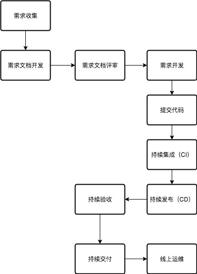

# 软件工程

一个软件研发团队，随着时间的发展，分工会越来越细，流程也会越来越清晰，好的流程会提高整个团队的研发效率，而为了让这个研发流程高效的运转起来，需要大量的工具和基础设施支撑。

## 软件生命周期

一个正常的产品生命周期，大致包括下图所有process，看起来很简单，但是要支撑这个流程的工具和基础设施太多了。

### 需求收集

参与者：产品、开发

内容：一个产品的生命周期，始于需求，有需求才有产品，所以最开始要做的工作就是需求收集。

工具：

### 需求文档开发

参与者：产品

内容：一个好的产品设计，产品可能一时脑洞大开，讲的天花乱坠，但是对于一个开发来讲，需要理解产品的需求，那如果产品能把需求落地到文档，这是最好的，因为在落地文档的过程当中，是需要产品对需求总结和反思的，在这个过程当中就可以让需求更加的明确，但是有时候需求复杂度很高，很难做到非常明确。

工具：wiki等可用于文档管理

### 需求评审

参与者：产品、开发、测试、以及其他项目参与人员

内容：需求文档开发完毕之后，紧接着就是需求评审，这个阶段参与者有：产品、开发、测试（某些公司可能没有，由开发和产品负责这个工作）、项目经理（某些公司可能没有，由dev leader扮演这个角色），这个过程主要是大家一起把需求review一遍，尽量的把需求的业务模型抽象出来，业务模型之间的关系要理清楚，这个阶段要求开发人员，甚至产品人员对UML要非常熟练，能够对业务需求抽象，落地到UML设计，这样就可以迅速模型化，落地到代码。

工具：wiki等可用户记录讨论结果

### 需求开发

参与者：开发、测试

内容：这个阶段的主要参与者是开发和测试

工具：IDE、代码版本管理工具(比如：git, svn)、代码仓库管理（因语言而已，maven之于Java，pip之于python）

### 代码提交

参与者：开发

内容：代码提交之后，需要code review，code review覆盖了传统的代码静态检查，参与者是其他开发人员或测试人员。

工具：git/svn，代码版本管理工具本身支持diff功能，就可以用来做code review。

### 持续集成

参与者：开发

内容：对于静态编译型语言来讲（比如：Java），CI过程就是一个编译的过程，编译的过程带有语法检查和单元测试执行，而对于动态解释性语言（比如：Python），它是没有编译过程的，当然可以有工具用来做简单的语法检查和单元测试。

工具：jenkins/travis等

### 持续发布

参与者：开发

内容：对于发布来讲，因跟服务器资源管理结合的比较紧，如果IDC是自建的，那发布系统基本上需要自研，如果用的是AWS，阿里云等云服务，因为这些云服务提供商已经标准化了服务器的管理，而且会开放接口，所以就可以在这些接口之上开发一个发布系统，而且AWS还自带了CD的功能。

工具：自研为主

### 持续验收

参与者：产品、测试

内容：主要是根据需求文档做验收。

工具：问题跟踪系统（比如：jira）

### 持续交付

参与者：产品、开发、测试

内容：在持续集成、持续发布、持续验收的基础上，就可以提供持续交付的功能。

### 线上运维

参与者：开发、运维、测试

内容：如果是C/S结构，当C端和S端发布后，上线生产之后，接下来就是运维了，关注的就是对应的指标和日志，然后根据指标和日志做出对应的运维操作。

工具：log工具（比如：ELK），metric（比如：statsd），trace（服务的调用链跟踪，一般都是自研）